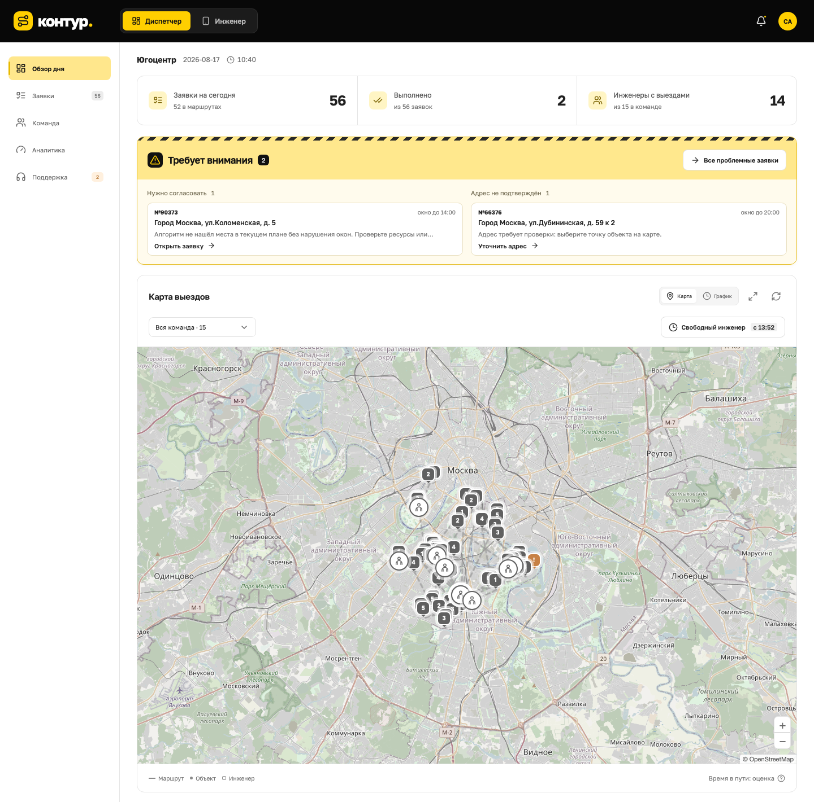
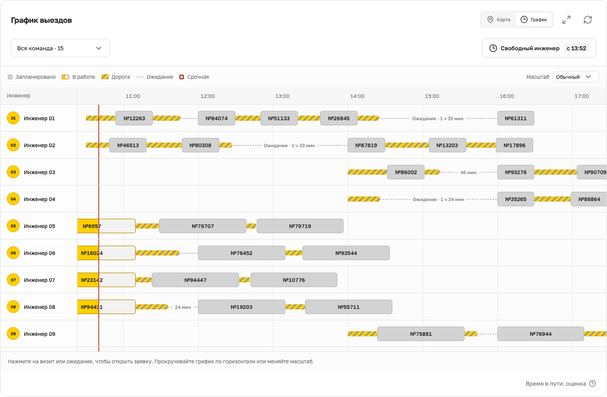
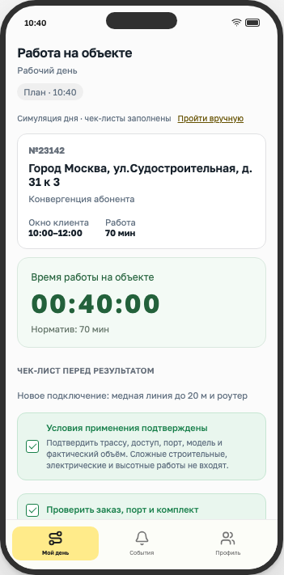

# Контур — планирование выездов Билайн

Веб-прототип для задачи №3 ЛЦТ: диспетчер планирует выезды и согласует изменения, инженер получает маршрут, комплект и чек-лист работ. ALNS и Google OR-Tools учитывают клиентские окна, квалификацию, оборудование, смены и уже начатые визиты.

**[Открыть демостенд](http://158.160.161.151)** · **[Пройти обучение](http://158.160.161.151/onboarding)** · **[Пульт демонстрации](http://158.160.161.151/hackathon)**

На демостенде один общий день для всех посетителей. Обучение создаёт отдельную учебную сессию и не меняет рабочий план.

[Установка](#быстрый-запуск) · [Сценарий знакомства](#что-попробовать) · [Проверки](#проверки) · [Документация](#документация-и-границы-прототипа)



Скриншоты текущего интерфейса от 29.09.2026: исходный набор «Югоцентр», время симуляции 10:40. [График выездов](screenshots/readme/gantt.png) · [Экран инженера](screenshots/readme/engineer.png).

## Что умеет прототип

- **Диспетчер:** карта и график Гантта, поиск заявок, команда, свободные окна и аналитика нагрузки. График различает работу, дорогу, ожидание и срочные визиты.
- **Изменения плана:** сравнение «было / стало», проверка ограничений и применение с уведомлением в интерфейсе. Отмена предпросмотра сохраняет действующий день.
- **Срочные заявки:** согласование времени и адреса, рекомендации до трёх инженеров с оценкой влияния на другие визиты.
- **Инженер:** сбор комплекта, выезд, прибытие, SOP-чек-лист, таймер на объекте, результат визита и обращение о недостающих материалах.
- **Демонстрация:** отдельный пульт, девять готовых наборов, генерация дня, события и сравнение алгоритмов. Обучение проводит через 21 шаг интерфейса.

<details>
<summary>График и экран инженера</summary>





</details>

## Быстрый запуск

Нужны **Git, Node.js и npm**. Поддерживаемый вариант установки: Node.js 20.19+, 22.12+ или 24.x. Чистая установка проверена на macOS с Node.js 20.20.2; Docker-образ использует Node.js 24. База данных, Docker и API-ключи для обычного запуска не нужны.

```sh
git clone https://github.com/notSarvar/kontur-lct-2026.git
cd kontur-lct-2026
npm ci
npm run dev
```

Оставьте терминал запущенным и откройте:

| Адрес                                                         | Назначение                                 |
| ------------------------------------------------------------- | ------------------------------------------ |
| [localhost:4317](http://localhost:4317)                       | Диспетчер; вкладка «Инженер» в шапке       |
| [localhost:4317/hackathon](http://localhost:4317/hackathon)   | Загрузка данных, события и время симуляции |
| [localhost:4317/onboarding](http://localhost:4317/onboarding) | Обучение на отдельном учебном дне          |

При первом запуске создаётся день «Югоцентр». Дальше сервер загружает сохранённое состояние из `.data/state.json`. Загрузка участка или генерация в пульте заменяет текущий день. Остановить сервер — `Ctrl+C`.

Карты загружают подложку OpenStreetMap через интернет. Расчёт на подготовленных данных использует локальные файлы; геокодирование при запуске не выполняется.

### Google OR-Tools — по желанию

ALNS работает сразу после `npm ci`. Для второго алгоритма нужен **Python 3.9+** и локальное виртуальное окружение.

macOS / Linux, из корня проекта:

```sh
python3 -m venv .venv-optimizer
.venv-optimizer/bin/python -m pip install -r requirements-optimizer.txt
```

Windows PowerShell:

```powershell
py -3 -m venv .venv-optimizer
.venv-optimizer\Scripts\python.exe -m pip install -r requirements-optimizer.txt
$env:ORTOOLS_PYTHON = (Resolve-Path .venv-optimizer\Scripts\python.exe).Path
npm run dev
```

Запускайте сервер после установки зависимостей. Выберите алгоритм в «Настройках расчёта»; доступность OR-Tools можно проверить по адресу `/api/optimizers`. Для другого окружения задайте `ORTOOLS_PYTHON` — путь к его исполняемому Python. Сравнение алгоритмов находится в пульте демонстрации.

### Запуск собранной версии

Остановите сервер разработки, затем выполните в той же папке:

```sh
npm run build
npm start
```

Адреса и сохранённый день остаются прежними. `npm start` требует заранее собранный `dist/`. Для Docker и Yandex Cloud есть [отдельная инструкция](docs/DEPLOYMENT.md): Compose-файл настроен под существующий сервер и его сеть.

### Настройки запуска

| Переменная         | По умолчанию                        | Назначение                                 |
| ------------------ | ----------------------------------- | ------------------------------------------ |
| `PORT`             | `4317`                              | HTTP-порт                                  |
| `HOST`             | `127.0.0.1`                         | Интерфейс, который слушает сервер          |
| `DATA_DIR`         | `.data` в корне проекта             | Каталог постоянного состояния              |
| `ORTOOLS_PYTHON`   | `.venv-optimizer/bin/python`        | Python с установленным OR-Tools            |
| `PRODUCT_ORIGIN`   | `http://localhost:<PORT>`           | Адрес рабочего интерфейса                  |
| `HACKATHON_ORIGIN` | `http://hackathon.localhost:<PORT>` | Дополнительный адрес пульта по имени хоста |

Пульт доступен и по `/hackathon` на адресе приложения; настройка DNS для локального знакомства не нужна. `hackathon.localhost` работает только локально, публичный адрес пульта — ссылка в начале README. Значения origin задаются без пути. Переменные нужно передать процессу: приложение не загружает `.env` автоматически.

Если порт занят, в macOS/Linux запустите `PORT=4318 npm run dev`; в PowerShell сначала выполните `$env:PORT = "4318"`. Чтобы открыть независимый день, задайте другой `DATA_DIR`. Не запускайте два сервера с одним каталогом состояния.

## Что попробовать

1. Начните с `/onboarding`: учебные действия не затрагивают общий день.
2. В `/hackathon` откройте «Данные Билайн» и загрузите участок. Основные наборы: Восток — 66, Юго-восток — 83, Югоцентр — 56 заявок; дополнительные дни находятся в отдельной группе.
3. В рабочем интерфейсе изучите карту и график, откройте заявку и попробуйте переназначение. Сравните предложенные изменения перед применением.
4. Добавьте срочную заявку через пульт. Если требуется согласование, откройте «Поддержку» и сравните рекомендованных инженеров.
5. Переключитесь на «Инженер». По умолчанию чек-листы заполняются автоматически для демонстрации; «Пройти вручную» включает сбор комплекта и ручное прохождение визита.
6. Продвиньте время в пульте и посмотрите обновления в обеих вкладках. Изменения передаются через SSE и сохраняются после перезапуска.

Время рабочего дня управляется симуляцией, а не часами сервера. При ручном визите таймер измеряет реальные секунды от начала работы до подтверждения результата. Подробности: [чек-листы](docs/ENGINEER_CHECKLISTS.md), [таймер](docs/WORK_TIMER.md), [неполный комплект](docs/KIT_SHORTAGES.md).

## Данные и расчёт

В репозитории есть три исходных синтетических CSV организаторов и шесть дополнительных независимых наборов. Исходные файлы Windows-1251 сохранены с контрольными суммами; геокэш и пешие матрицы подготовлены заранее. Инженеры и их доступность моделируются отдельно — в CSV заявок их нет. JSON-импорт поддерживает до 200 заявок и 40 инженеров, генератор — до 100 заявок.

Планировщики проверяют навыки, оборудование, транспорт, клиентское окно начала, длительность работы, смену, перерыв и текущий выезд. Есть цели экономии ресурсов и аварийного реагирования, баланс нагрузки и сравнение с базовым алгоритмом из ТЗ. ALNS — эвристика; ограниченный по времени расчёт OR-Tools также не обязательно доказывает оптимальность.

[Модель, нормативы и точность карт](docs/MODEL_AND_DATA.md) · [Дополнительные дни и их даты](docs/ADDITIONAL_DAYS.md) · [Допущения и ограничения](docs/ASSUMPTIONS.md).

## Проверки

```sh
npm test
npm run build
npm run format:check
```

На 29.09.2026 проходят **99 модульных тестов** с установленным OR-Tools. Проверяются планирование, ограничения, исходные данные, действия инженера, согласование, SOP, недостача материалов, обучение и таймер. Без Python проверки, которым нужен OR-Tools, пропускаются.

Браузерные сценарии меняют день: запускайте их на отдельном экземпляре. Для macOS/Linux:

```sh
npx playwright install chromium
# Терминал 1: отдельный каталог состояния и порт
DATA_DIR=.data/e2e PORT=4318 npm run dev
```

Во втором терминале, из корня проекта:

```sh
TEST_URL=http://127.0.0.1:4318 npm run test:e2e
```

В PowerShell задавайте соответствующие переменные через `$env:DATA_DIR`, `$env:PORT` и `$env:TEST_URL` перед командой. Проверка внешних карт включается отдельно через `LIVE_MAPS=1`.

Сравнение алгоритмов: `npm run benchmark` и `npm run benchmark:optimizers`; проверка дополнительных наборов: `node scripts/check-additional-days.mjs`. Эти команды сохраняют отчёты или выводят результаты расчёта — они не нужны для обычного запуска.

Свежие скриншоты README: после `npm run build` и установки Chromium выполните `node scripts/capture-readme.mjs`. Скрипт сам создаёт временный день и локальный сервер, снимает три экрана и останавливает свой сервер. Нужен интернет для подложки карты.

## Структура проекта

```text
src/             React: диспетчер, инженер, обучение, общие компоненты
server/          HTTP и SSE, действия, модель, ALNS и OR-Tools, хранилище
data/beeline/    исходные CSV, дополнительные дни, нормативы и геоданные
data/sop/        исходные регламенты и шаблоны чек-листов
deploy/          Docker Compose, Nginx и резервное копирование
scripts/         подготовка данных, сравнения и скриншоты
tests/           модульные тесты и браузерные сценарии Playwright
docs/            модель, сценарии работы, ограничения и развёртывание
```

## Документация и границы прототипа

| Задача                         | Документ                                                                                                                   |
| ------------------------------ | -------------------------------------------------------------------------------------------------------------------------- |
| Разобраться в интерфейсе       | [Руководство диспетчера и инженера](docs/system/README.md), [обучение](docs/ONBOARDING.md)                                 |
| Подготовить показ              | [Пульт и сценарии демонстрации](docs/demo/README.md), [результат первого расчёта](docs/FIRST_PLAN_RESULT.md)               |
| Понять планирование            | [Математическая модель](docs/SPEC.md), [OR-Tools и сравнение алгоритмов](docs/OPTIMIZERS_WORKLOAD_SOP.md)                  |
| Согласовать срочную заявку     | [Подбор инженеров и диаграммы](docs/URGENT_ENGINEER_RECOMMENDATIONS.md)                                                    |
| Развернуть или обновить сервер | [Yandex Cloud, Docker, резервные копии](docs/DEPLOYMENT.md)                                                                |
| Проверить требования к сдаче   | [Аудит имеющегося ТЗ от 27.09](docs/SUBMISSION_READINESS.md), [соответствие функций ТЗ](docs/FEATURES_VS_OFFICIAL_SPEC.md) |

Это общая демонстрационная среда без авторизации и разграничения пользователей. Звонки и контактные данные в интерфейсе демонстрационные; CRM-интеграции, реального GPS и push при закрытом браузере нет. Дорога общественным транспортом оценочная, геокэш неполон. Переключение роли не является входом под отдельной учётной записью.

Состояние одного дня сохраняется в JSON; обучение и предпросмотры живут в памяти. Импорт JSON создаёт новый расчёт из входных данных, а не восстанавливает журнал работы. Автоматического переноса смен между днями и полного архива версий планов нет. Подробности и расхождения с ТЗ перечислены в [реестре допущений](docs/ASSUMPTIONS.md).
