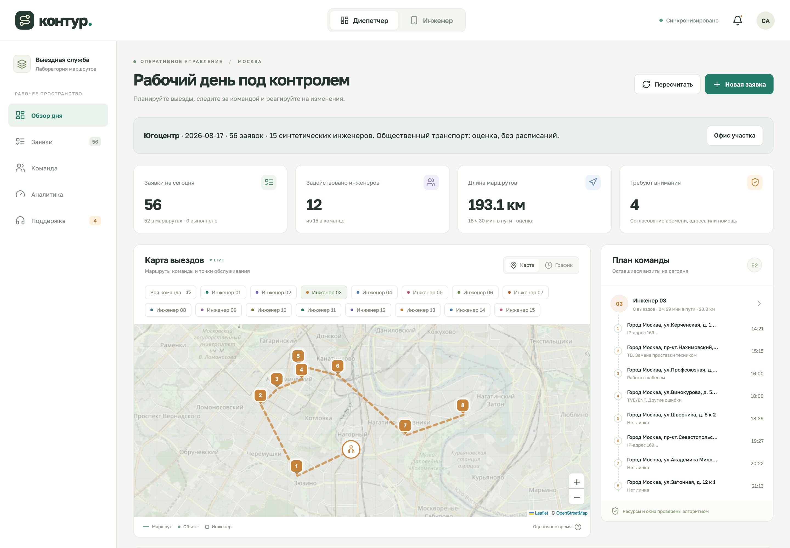

# Контур — планирование выездов Билайн

Прототип диспетчерского сервиса для задачи №3 ЛЦТ: три синтетических участка, нормативы организаторов, синтетические инженеры, маршруты, ALNS и ручное согласование конфликтов.

[Четыре доработки: управление, цели, изменения, география](docs/IMPLEMENTED_CHANGES.md)

[Предыдущий отчёт для команды: PDF и скриншоты](reports/team-update-2026-09-17/README.md) · [Итоговый слайд](reports/team-update-2026-09-17/kontur-summary-slide.pdf)



## Запуск

Node.js 20.19+ или 22.12+.

```sh
npm ci
npm run dev
```

Открыть http://localhost:4317. По умолчанию загружается Югоцентр. Другой участок выбирается кнопкой **«Данные Билайн»**. Для production-сборки: `npm run build`, затем `npm start`.

Параметры: `PORT` (4317), `HOST` (127.0.0.1), `DATA_DIR` (`.data`). Состояние сохраняется атомарно в JSON; вкладки синхронизируются через SSE. При переходе со старой версии лаборатории её состояние сохраняется в `.data/state-v1-*.backup.json`, а новый день создаётся из официальных данных.

## Сценарий демонстрации

1. Загрузить участок: Восток — 66, Юго-восток — 83, Югоцентр — 56 заявок. Контрольные распределения не используются.
2. Посмотреть карту, график, исполнителей и километраж. В «Команде» можно менять навыки и смены, добавлять инженеров.
3. В «Аналитике» сравнить ALNS с базовым алгоритмом: назначенные заявки, число инженеров, километры, время. Сравнение использует одинаковый состав и поездки.
4. Открыть любую ещё не начатую заявку → «Переназначить» → выбрать инженера → «Проверить переназначение». Сравнить карты, метрики, порядок и время; применить план либо отменить изменения.
5. Добавить срочную заявку. Предпросмотр переключится в аварийный режим; активный день изменится только после «Применить план». Уже начатые выезды остаются закреплены.
6. Если допустимый план не найден, открыть «Поддержку» → **«Согласовать заявку»**. Указать результат разговора с клиентом, новое окно либо исправленные координаты. При необходимости выбрать исполнителя вручную.
7. После подтверждения система повторно проверяет все ограничения. Исходное окно, комментарий и история изменения сохраняются. Если выбранный инженер не может выполнить визит, применение заблокировано. Без закрепления невыполнимая заявка остаётся на согласовании.
8. Продвинуть время: поездки и работы выполняются в симуляции. Экран инженера, заметки, перерывы и обращения также работают.

## Входные данные и нормативы

`data/beeline/` содержит только три исходных CSV в Windows-1251, их SHA-256, компоненты Excel-нормативов, геокэш и явно описанные допущения об офисах. CSV импортируется с сохранением исходных ID, порядка и полей; строки офиса не становятся заявками. Все даты — 17.08.2026, время московское. Каждая строка предполагает отдельный визит, даже если адрес совпадает.

| Работа                       | Работа на адресе | Навык                  |
| ---------------------------- | ---------------: | ---------------------- |
| Локальная заявка             |           30 мин | Локальные работы       |
| Подключение                  |           70 мин | Подключения и дозаказы |
| Дозаказ                      |           20 мин | Подключения и дозаказы |
| Глобальная проблема / авария |           80 мин | Аварийные работы       |

Работа на адресе = технические работы + документы. В Excel отдельно заложено 20 минут дороги: в расписании их заменяет рассчитанный переезд, двойного учёта нет. По решению пользователя все «Глобальные проблемы», включая шесть строк «Информация», считаются срочными аварийными работами.

Инженеры в предоставленных синтетических CSV отсутствуют. Пул выводится из нагрузки по навыкам и двум сменам (08–17 и 14–23): на заявку для оценки штата берётся работа + 20 минут условной дороги, целевая занятость — 65% смены. Пересекающиеся окна делят нагрузку между сменами. Получаются 18 / 20 / 15 инженеров соответственно. Это демонстрационное допущение о доступном штате, не найденный математический минимум. Состав фиксируется **до** запуска обоих алгоритмов; планировщик не создаёт людей при конфликте.

JSON экспортирует входы, включая ID, исходные поля и неподтверждённые адреса. Импорт создаёт новый день, а не восстанавливает готовые маршруты или историю. Поддерживается до 100 заявок и 40 инженеров на сценарий.

## Алгоритм

`server/optimization/` реализует собственный вариант **Adaptive Large Neighborhood Search** на JavaScript. Это полноценный эвристический поиск по допустимым расписаниям, без гарантии глобального оптимума и без OR-Tools.

- Начальные решения: базовый алгоритм, последовательная вставка и regret-2 по альтернативным исполнителям.
- Удаления: случайная группа, близкие по месту/окну заявки, целый маршрут.
- Восстановление: regret-2 либо последовательная допустимая вставка во все позиции.
- Вероятности операторов адаптируются по найденным улучшениям. Допускается ограниченное разнообразие промежуточных решений; возвращается лучший найденный план, не хуже базового по выбранной целевой функции.
- Seed фиксирует порядок поиска. По умолчанию 60 итераций; воспроизводимый benchmark запускает 100.

Первые две цели общие: **неназначенные срочные → все неназначенные**. Далее:

- **Экономия (`economy`, по умолчанию):** задействованные инженеры → ожидание аварий → смены исполнителя → километры → время в пути.
- **Аварийное реагирование (`emergency`):** ожидание аварий → инженеры → смены исполнителя → километры → время в пути.

Ожидание считается от `max(createdAt, windowStart)` и не обнуляется при пересчёте. У исходных заявок `createdAt=0`; новая авария переключает режим на `emergency`. Режим можно выбрать в верхней панели или настройках через предпросмотр. Стабильность при желании отключается. Окно ограничивает начало работы, окончание ограничивается сменой.

Жёстко проверяются навыки, ресурсы/транспорт, координаты, дорога, длительность, окно начала, конец смены, перерыв и зафиксированный текущий выезд. Возврат в офис не требуется. Сообщение «не удалось назначить» означает результат эвристики, а не доказанную невозможность задачи.

Базовый алгоритм точно следует §2.3 PDF: исходный порядок заявок, первый допустимый инженер во входном порядке, добавление в конец маршрута. Он не выбирает ближайшего исполнителя и не сортирует заявки по срочности.

Метод основан на схеме [Ropke и Pisinger, ALNS](https://pubsonline.informs.org/doi/10.1287/trsc.1050.0135); код здесь самостоятельный, адаптированный к текущим ограничениям. Подробная модель и принятые решения — [docs/SPEC.md](docs/SPEC.md).

## Согласование и состояние заявки

`pending → enroute → working → done`. Неназначенные переходят в `manual_review` — **«Требует согласования»**. Они учитываются в очереди и общем количестве; повторный расчёт не изменяет их окно и не возвращает их в работу без действия диспетчера. Статус `blocked` относится к проблеме на уже назначенном объекте и обрабатывается отдельно.

`job.resolve` требует комментарий диспетчера. Старое/новое окно и координаты записываются в `history`; исходное клиентское окно сохраняется в `originalWindow`. Ручной выбор инженера не отменяет проверки навыка, окна и смены. Уведомление клиенту не отправляется автоматически: контакт выполняется человеком вне прототипа.

## Карты: текущая точность

В настройках доступны два режима для ходьбы и общественного транспорта:

- **Оценочный** (сохраняется по умолчанию для произвольных новых точек): ходьба — расстояние × 1,25 / 4,8 км/ч; общественный транспорт — расстояние × 1,35 / 23 км/ч + 12 минут.
- **Подготовленная пешая матрица:** направленные времена и расстояния по дорожной сети из бесплатного [FOSSGIS Routing](https://routing.openstreetmap.de/about.html). Матрицы всех трёх участков и часть геометрий хранятся в `walking-matrices.json`; при расчёте сетевых запросов нет. `null` обозначает недоступный пеший путь; неизвестная точка вызывает `DATA_NOT_READY`, без скрытого перехода к оценке.

В обоих режимах общественный транспорт **оценочный**, без реальных линий, пересадок, расписаний и пробок; для инженера выбирается более быстрый из пешего и транспортного вариантов. Сплошные участки — сохранённая пешая геометрия, пунктир — схема. Дополнительный автомобильный OSRM не подменяет пешеходную модель.

После уточнения новых точек: явно выбрать оценочный режим, подтвердить координаты, подготовить матрицу сохранённого дня командой ниже, затем включить пешую дорожную матрицу в настройках. Подготовка обращается к внешнему провайдеру с интервалом 1,1 секунды, учитывает кэш и останавливается при ошибке.

```sh
# Все три исходных синтетических участка:
npm run data:walking -- --geometry
# Текущий участок с подтверждёнными вручную точками:
npm run data:walking -- --state .data/state.json --geometry
```

Источник можно заменить через `WALKING_ROUTER_URL`. Соблюдайте [условия провайдера](https://routing.openstreetmap.de/about.html); это небольшая разовая подготовка демо, не массовая выгрузка.

Адреса подготовлены однократно через Nominatim с кэшем. Если здание не определено или номер не совпадает, координаты остаются пустыми: заявка требует проверки на карте. Два адреса офисов в CSV содержат «строение», тогда как найденные городские данные указывают «корпус»: предварительные точки и источник перечислены в `office-assumptions.json` и отмечены в интерфейсе. Их можно изменить в форме «Офис участка».

Геоданные © OpenStreetMap contributors, [ODbL](https://www.openstreetmap.org/copyright). Публичный Nominatim разрешает ограниченные разовые задачи: один поток, не чаще 1 запроса/сек., идентифицирующий User-Agent, обязательный кэш. Скрипт использует интервал 1,1 секунды, не вызывается при запуске приложения и не предоставляет автодополнение. Перед повторной подготовкой прочитайте [политику использования](https://operations.osmfoundation.org/policies/nominatim/). Провайдер меняется через `GEOCODER_URL`. Обычный запуск приложения использует готовый геокэш и не отправляет адреса.

```sh
npm run data:geocode
# уточнение ещё не обработанных неоднозначных адресов:
node scripts/geocode.mjs --refine
```

## Структура

```text
server/
  index.js                 точка запуска
  http/                    HTTP, SSE, frontend
  domain/                  справочники, сценарии, штат, валидация, жизненный цикл, экспорт
  application/             команды диспетчера и перепланирование
  optimization/            поездки, проверка маршрута, построение, ALNS, метрики
  infrastructure/          CSV, геокэш, OSRM, хранилище
src/
  main.jsx                 точка входа React
  app/                     состояние и сборка экранов
  components/              общие элементы, карта, временная шкала
  features/                заявки, инженеры, аналитика, сценарии
  shared/                  форматирование и подписи
scripts/                   подготовка координат, benchmark
data/beeline/              исходные данные и происхождение
docs/                      ТЗ, модель, отчёт сравнения
tests/                     модель, действия, данные, браузерные сценарии
```

## Проверки

```sh
npm test
npm run build
npm run format:check
npm run benchmark
```

Проверки включают 35 воспроизводимых сценариев, жёсткие ограничения, текущие выезды, официальный базовый алгоритм, конфликт с аварией, согласование и аудит, повторный импорт, все три участка. На небольшом примере результат дополнительно сравнивается с независимым полным перебором. Benchmark двух политик и двух источников поездок сохраняется в `docs/benchmark-v2.json`; прежний `benchmark.json` относится к предыдущему отчёту; проценты экономии не выводятся при разных наборах выполненных заявок.

Для браузера:

```sh
npx playwright install chromium
DATA_DIR=/tmp/kontur-test PORT=4318 npm run dev
TEST_URL=http://127.0.0.1:4318 npm run test:e2e
```

В этой среде браузеры установлены в `/tmp/lct-playwright`: добавьте `PLAYWRIGHT_BROWSERS_PATH=/tmp/lct-playwright`. Браузерные тесты меняют тестовый день, поэтому используйте отдельный `DATA_DIR`. Проверка реальных внешних карт включается отдельно через `LIVE_MAPS=1`.

## Границы прототипа

Кандидаты живут в памяти 15 минут, после перезапуска нужен новый предпросмотр; активный план, последний diff и аудит применения сохраняются. Полного архива неизменяемых версий и независимого валидатора всех ограничений пока нет. Нет авторизации, CRM-интеграции, автоматических звонков, push при закрытом браузере и реального GPS. История относится к одному дню. Отмена/перенос на следующий день не создаёт много-дневное расписание. Штат, смены и транспортные скорости синтетические. Планировщик — эвристика, геокэш неполон, два офиса требуют уточнения, общественный транспорт оценочный. Эти ограничения видны в продукте и не выдаются за официальные данные.
