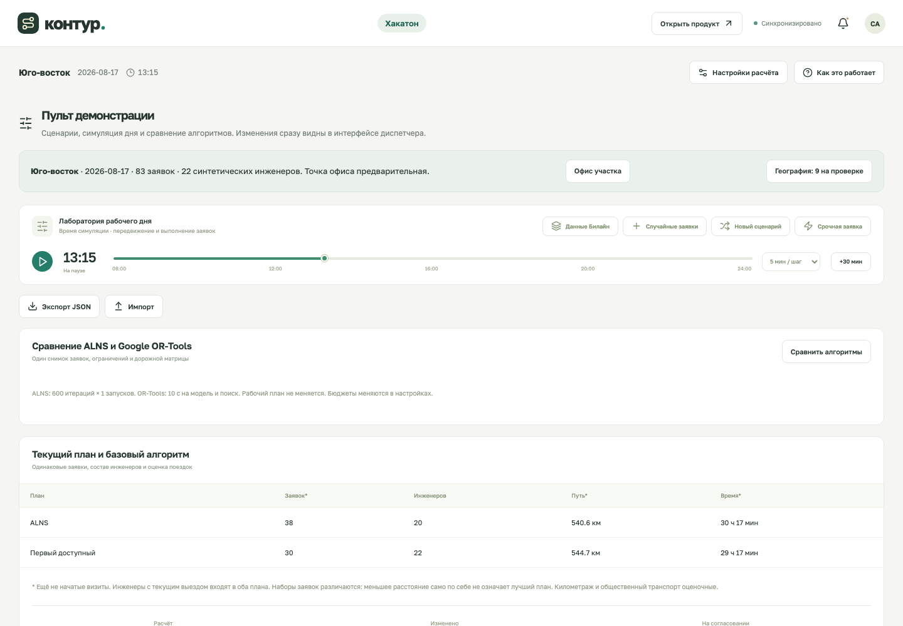

# Пульт демонстрации: инструкция по кнопкам

Актуально на 26.09.2026. Инструкция для участника команды, который управляет показом на хакатоне.

**Пульт:** http://hackathon.localhost:4317 · **Продукт:** http://localhost:4317

Оба адреса локальные и управляют **одним рабочим днём**. Изменение в пульте сразу видно диспетчеру и инженеру. Для запуска сервера — [основной README](../../README.md), для работы диспетчера — [инструкция системы](../system/README.md).

## Перед показом

1. Откройте пульт и нажмите **«Открыть продукт»** — рабочий интерфейс появится во второй вкладке. На проекторе можно оставить продукт, а пульт держать на своём экране.
2. Выберите один исходный сценарий и проверьте его заранее. Загрузка участка, генерация нового дня и импорт заменяют текущий день.
3. Убедитесь, что вверху показано **«Синхронизировано»**. Поставьте симуляцию на паузу перед сравнением алгоритмов и демонстрацией предпросмотра.
4. Для повтора сохраните участок либо сочетание **seed + число заявок + число инженеров + настройки расчёта**. Экспорт JSON сохраняет входные данные, но не является резервной копией всей сессии.
5. Запускайте автоматическое время только в одной вкладке пульта: таймер каждой открытой вкладки работает самостоятельно.

## Верхняя панель

| Элемент                                    | Что делает                                                                         | Меняет рабочий день?                                      |
| ------------------------------------------ | ---------------------------------------------------------------------------------- | --------------------------------------------------------- |
| **«Открыть продукт»**                      | Открывает интерфейс диспетчера в новой вкладке                                     | Нет                                                       |
| **«Настройки расчёта»**                    | Открывает выбор алгоритма, бюджет поиска, приоритеты, поездки и баланс             | Только после «Применить и пересчитать» → «Применить план» |
| **«Как это работает»**                     | Показывает справку об алгоритме и ограничениях                                     | Нет                                                       |
| Колокольчик **«Уведомления»**              | Открывает события рабочего дня                                                     | Нет                                                       |
| Логотип **«контур.»**                      | Возвращает к основному экрану текущего интерфейса; на адресе пульта остаётся пульт | Нет                                                       |
| **«Синхронизировано» / «Переподключение»** | Показывает состояние связи с сервером                                              | Это индикатор, не кнопка                                  |

Инициалы справа — декоративный элемент прототипа, входа в учётную запись за ними нет.

## «Данные Билайн» — загрузить готовый участок

Открывает окно **«Синтетические данные Билайн»**. Выберите участок и нажмите **«Загрузить участок»**:

| Участок    | Заявки | Синтетические инженеры при новой загрузке |
| ---------- | -----: | ----------------------------------------: |
| Восток     |     66 |                                        17 |
| Юго-восток |     83 |                                        22 |
| Югоцентр   |     56 |                                        15 |

Система создаёт новый день с 08:00, загружает заявки и нормативы, генерирует штат и рассчитывает план. **Прежний день, отчёты и история заменяются.** Настройки создаются заново; после загрузки проверьте выбранный алгоритм и режим. **«Отмена»** закрывает форму без загрузки.

Некоторые адреса и два офиса требуют проверки. Это ожидаемое состояние данных: часть заявок может сразу оказаться на согласовании. Выбор другого участка не объединяет его заявки с текущими.

## «Новый сценарий» — сгенерировать учебный день

В окне **«Новый рабочий день»** доступны:

| Поле или кнопка                              | Действие                                                                                |
| -------------------------------------------- | --------------------------------------------------------------------------------------- |
| **«Заявок»**                                 | Задаёт от 1 до 100 заявок                                                               |
| **«Инженеров»**                              | Задаёт от 1 до 40 инженеров                                                             |
| **«Seed — число для повторяемого сценария»** | Задаёт последовательность генерации; целое число от 0 до 4294967295                     |
| **«Спокойный день»**                         | Подставляет 12 заявок и 4 инженеров; сам день ещё не создаётся, seed не меняется        |
| **«Высокая нагрузка»**                       | Подставляет 35 заявок и 3 инженеров; подходит для демонстрации нехватки ресурсов        |
| **«Повторить seed»**                         | Подставляет seed и число заявок текущего дня. Число инженеров проверьте отдельно        |
| **«Сгенерировать день»**                     | Заменяет текущий день и историю, возвращает время на 08:00, рассчитывает новые маршруты |
| **«Отмена»**                                 | Закрывает форму без изменений                                                           |

Для буквального повтора генератора должны совпадать не только seed, но и размеры сценария и настройки. Кнопка «Повторить seed» **не восстанавливает исходный CSV участка Билайн**: для него используйте «Данные Билайн». Генератор сохраняет текущие настройки оптимизатора, но переключает поездки в оценочный режим.

## «Случайные заявки» — добавить поток в существующий день

1. Нажмите **«Случайные заявки»**.
2. Выберите количество от 1 до 20 и seed.
3. Нажмите **«Добавить и перепланировать»**.

Заявки добавятся к текущим; время, завершённые работы и отчёты сохранятся. Остаток плана пересчитается **сразу, без отдельного предпросмотра**. Если среди добавленных есть срочная заявка, включится аварийный режим. Всего в дне должно остаться не более 100 заявок.

Это случайный поток разных типов, а не гарантированное добавление только аварий. Для конкретного события используйте кнопку «Срочная заявка». В подготовленном дорожном режиме новых точек может не быть в матрице — тогда сначала переключите поездки на оценку либо подготовьте матрицу.

## «Срочная заявка» — управляемое событие для защиты

Кнопка открывает обычную форму новой заявки с типом **«Авария на ТКД»**, приоритетом **«Срочный»** и длительностью работы 80 минут.

1. Введите название и адрес объекта.
2. **Выберите положение на карте или введите координаты.** Текст адреса служит подписью: автоматического поиска здания по введённой строке нет. Не оставляйте исходную учебную точку по ошибке.
3. Задайте **«Окно: с»** и **«Начать до»**. Для демонстрации немедленного реагирования поставьте начало окна на текущее время дня: форма по умолчанию предлагает будущий слот.
4. Проверьте длительность, навык, требуемый транспорт и оборудование. Длительность означает работу на адресе; дорогу добавлять к ней не нужно.
5. Нажмите **«Создать и перепланировать»**. Сначала появится **предпросмотр**, действующий день пока не изменится.
6. Рассмотрите карты **«Было» / «Стало»**, изменившиеся заявки, маршруты и показатели. Можно выбрать отдельного инженера в **«Маршрут для сравнения»**.
7. **«Применить план»** сохраняет вариант; **«Отменить изменения»** отклоняет его вместе с добавлением новой заявки.

Новая авария переключает кандидат в аварийный режим. Пересчитывается весь доступный остаток дня; активный выезд/работа и выполненные заявки сохраняются. Если обычная заявка больше не помещается, она попадает на согласование. Её клиентское окно алгоритм не расширяет.

Если остальные маршруты почти не изменились, это допустимый результат: в текущем плане хватило свободного места. Не обещайте зрителям определённое количество перестановок.

## Управление временем

| Кнопка или поле                           | Что происходит                                                                                                                   |
| ----------------------------------------- | -------------------------------------------------------------------------------------------------------------------------------- |
| **▶ «Запустить симуляцию»**               | Запускает продвижение модельного времени. По плану начинаются поездки/работы, завершаются визиты и обновляются позиции инженеров |
| **⏸ «Пауза симуляции»**                   | Останавливает таймер этой вкладки. Уже прошедшее время не отменяется                                                             |
| **«Скорость симуляции»**                  | 1, 5 или 15 модельных минут за шаг. Попытка шага — примерно раз в 1,4 секунды; во время занятого расчёта шаг пропускается        |
| Ползунок **«Время рабочего дня»**         | Переход вперёд с шагом 5 минут, до 24:00. Останавливает автосимуляцию и сразу обрабатывает прошедшие события                     |
| **«+30 мин»**                             | Сразу продвигает день на 30 минут, максимум до 24:00, и пересчитывает остаток. Если таймер был запущен, он продолжит работу      |
| **«Остановить симуляцию»** внизу страницы | Останавливает тот же таймер                                                                                                      |

Время нельзя вернуть назад ползунком. Для повторного показа загрузите участок заново или создайте новый день с теми же параметрами. На 24:00 автосимуляция заканчивается. Закрытие/перезагрузка вкладки прекращает её таймер, но сервер сохраняет достигнутое время.

Открытие формы через кнопки пульта ставит его симуляцию на паузу. **«Сравнить алгоритмы»** само таймер не останавливает: перед сравнением нажмите паузу, иначе результаты могут успеть устареть.

## «Офис участка» и «География: … на проверке»

Эти кнопки в плашке участка появляются после загрузки встроенных данных Билайн.

**«Офис участка»:** выберите точку базы, проверьте широту/долготу и укажите источник. **«Подтвердить точку»** рассчитывает предпросмотр; затем нужен **«Применить план»**. Базы всех инженеров участка обновятся; у уже работавших инженеров сохраняется текущее положение. Во время активных выездов менять офис нельзя.

**«География: … на проверке»:** открывает адреса без координат. Выберите заявку, найдите здание на карте или введите координаты, при наличии проверьте предложенный вариант. Заполните **«Источник подтверждения»** и нажмите **«Проверить план с этой точкой»** → **«Применить план»**. Одинаковые точные адреса ещё не начатых визитов обновятся вместе. Если предварительна база, здесь есть **«Проверить офис»**.

Подтверждение координат не обновляет дорожную матрицу автоматически и не превращает оценочный общественный транспорт в точный.

## «Экспорт JSON» и «Импорт»

**«Экспорт JSON»** скачивает входные заявки, инженеров, историю прошлой нагрузки и SOP. Рабочий день не меняется. Файл можно использовать как заготовку для повторного сценария.

**«Импорт»:** выберите JSON и проверьте числа в окне **«Загрузить сценарий?»**. **«Заменить сценарий»** создаёт новый день с 08:00 и заново распределяет работы; **«Отмена»** закрывает окно без замены.

При импорте сбрасываются ход выполнения, отметки SOP, отчёты и текущие позиции. Сохраняются входные параметры, индивидуальное содержание SOP, закрепления и переданная история нагрузки. Текущие настройки оптимизатора сохраняются, а поездки переключаются на оценку: настройки не берутся из файла. Экспорт/импорт **не восстанавливает текущую сессию целиком**. Ограничения: 1–100 заявок, 1–40 инженеров. Набор «Хутор» на 500 заявок исследуется [отдельными CLI-командами](../BENCHMARK_KHUTOR.md), не этой кнопкой.

## «Настройки расчёта»

| Поле                                      | Значение для демонстрации                                                                                                         |
| ----------------------------------------- | --------------------------------------------------------------------------------------------------------------------------------- |
| **«Алгоритм расчёта»**                    | Наш ALNS или Google OR-Tools CP-SAT. OR-Tools доступен, если установлен локальный Python-пакет по основному README                |
| **«Итераций на запуск»**                  | Для ALNS: 0–1000. Больше итераций — больше попыток улучшить план; 0 оставляет построение начального решения                       |
| **«Запусков с разными seed»**             | Для ALNS: 1–5. Дополнительные запуски начинают с лучшего найденного плана и пробуют другой ход поиска                             |
| **«Бюджет OR-Tools, секунд»**             | 1–60 секунд на модель и поиск. Полное ожидание включает также подготовку и проверку результата                                    |
| **«Цель планирования»**                   | «Экономия» предпочитает меньше инженеров; «Аварийное реагирование» — меньше ожидания срочных. Обе цели идут после покрытия заявок |
| **«Время переездов»**                     | Оценка; подготовленная пешая дорожная матрица с оценочным общественным транспортом; OSRM для авто                                 |
| **«Баланс работы с учётом прошлых смен»** | Учитывает введённую прошлую работу и доступное время вместе с текущим днём. Без истории используется только текущая нагрузка      |
| **«Сохранять назначенного инженера»**     | Предпочитает прежнего исполнителя после более важных целей. Не фиксирует время и порядок визитов                                  |
| **«Шаблоны работ»**                       | Открывает редактор стандартных SOP; подробнее в инструкции системы                                                                |
| **«Применить и пересчитать»**             | Создаёт предпросмотр новых настроек; окончательное сохранение — «Применить план»                                                  |
| **«Отмена»**                              | Закрывает форму без применения введённых настроек                                                                                 |

Настройки общие для пульта и продукта. Новая срочная заявка включает аварийный режим; обратно в экономию переключайтесь вручную. Не увеличивайте бюджет прямо перед показом без пробного расчёта: более долгий поиск не улучшает точность исходных дорог.

## «Сравнить алгоритмы» и таблицы результатов

**«Сравнить алгоритмы»** запускает ALNS и OR-Tools последовательно на одном снимке заявок, ресурсов, ограничений и поездок. Используются бюджеты из настроек. Действующий маршрут не заменяется, кнопки применения результата в этой таблице нет.

В таблице:

- **«Первый доступный · ТЗ»** — базовое назначение в исходном порядке без глобальной оптимизации.
- **ALNS / Google OR-Tools** — результаты двух решателей.
- **«Размещено»** — ещё не начатые назначенные визиты; текущая закреплённая работа рассматривается отдельно.
- **«Инженеров», «Км», «В пути», «Расчёт»** — состав и затраты найденного плана, длительность вычисления.
- **«Приоритеты и статусы поиска»** — подробности CP-SAT: `OPTIMAL` означает оптимальность отдельного этапа, `FEASIBLE` — допустимое найденное решение, `UNKNOWN` — за бюджет результат этапа не установлен. Все этапы должны быть оптимальными, чтобы говорить об оптимуме модели.

Если наборы назначенных заявок отличаются, меньший километраж сам по себе не доказывает лучший результат. Если остался общий начальный план, это явно указано: не представляйте его как найденное Google улучшение. Результат может устареть после любого изменения дня; об этом появляется сообщение.

Ниже находится **«Текущий план и базовый алгоритм»**: это сравнение уже действующего плана с baseline, а не те же два свежих результата. Далее показываются последние изменения заявок и маршрутов. Поиск OR-Tools не требуется для просмотра этой таблицы.

## Короткий сценарий показа на 5–7 минут

| Шаг | Что нажать                                                                              | Что объяснить                                                   |
| --- | --------------------------------------------------------------------------------------- | --------------------------------------------------------------- |
| 1   | «Данные Билайн» → заранее проверенный участок → «Загрузить участок» → «Открыть продукт» | Входные данные, штат и допущения                                |
| 2   | В продукте: «Обзор дня», раскрыть инженера, открыть заявку на карте/графике             | Навык, клиентское окно, длительность и маршрут                  |
| 3   | В пульте посмотреть «Текущий план и базовый алгоритм»                                   | Обязательные метрики и сравнение на одинаковых данных           |
| 4   | В пульте: «Срочная заявка» → заполнить заранее выбранный адрес/точку/окно               | Какие ограничения у нового события                              |
| 5   | Рассмотреть предпросмотр → «Применить план»                                             | Что изменилось и какие выезды сохранены                         |
| 6   | Вернуться в продукт: «Требует внимания» / «Поддержка», либо экран инженера              | Последствия для диспетчера и исполнителя                        |
| 7   | По оставшемуся времени: показать SOP, баланс или сравнение ALNS/OR-Tools                | Одно из [расширений сверх MVP](../FEATURES_VS_OFFICIAL_SPEC.md) |

Если нужен полностью сгенерированный пример вместо участка, начните с «Новый сценарий» → «Спокойный день» и заранее запишите seed. Для демонстрации конкретного переназначения сначала убедитесь, что выбранное событие его действительно вызывает.

## Если что-то пошло не так

| Сообщение или ситуация               | Что сделать                                                                                                                                      |
| ------------------------------------ | ------------------------------------------------------------------------------------------------------------------------------------------------ |
| **«План изменился после расчёта»**   | Остановить симуляцию во всех пультах, закрыть кандидат и повторить действие на актуальном дне                                                    |
| **«Предпросмотр истёк»**             | Пересчитать вариант; срок применения — 15 минут, перезапуск сервера тоже удаляет кандидаты                                                       |
| OR-Tools недоступен                  | Использовать ALNS либо установить зависимости по основному README; это не ошибка входных заявок                                                  |
| Нет точки в подготовленной матрице   | Явно выбрать оценочный режим или подготовить матрицу с новой точкой                                                                              |
| Заявка «Требует согласования»        | Открыть карточку, прочитать причину; дальнейшие расчёты сами её не вернут без согласования                                                       |
| Хочется вернуть время назад          | Повторно загрузить исходный участок/сгенерировать день. Экспорт не является снимком выполнения                                                   |
| Видна ошибка лимита заявок           | Уменьшить размер добавления; в UI максимум 100 заявок                                                                                            |
| `hackathon.localhost` не открывается | Проверить запуск сервера и открыть адрес в Chrome/Chromium. Настройка локального имени описана в [инструкции адресов](../HACKATHON_WORKSPACE.md) |

Справочные материалы: [допущения](../ASSUMPTIONS.md), [технический README](../../README.md), [работа в системе](../system/README.md).
