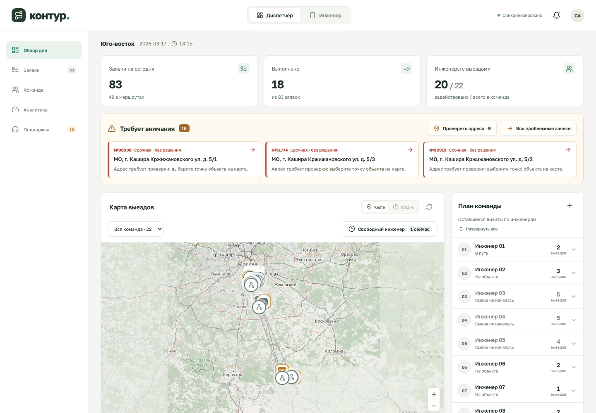

# Контур: руководство по системе

Актуально на 26.09.2026. Инструкция для диспетчера, инженера и участников команды, знакомящихся с продуктом.

**Рабочий интерфейс:** http://localhost:4317. Запуск и установка описаны в [основном README](../../README.md).

Контур распределяет заявки между выездными инженерами, проверяет навыки, оборудование, смены и клиентские окна, рассчитывает последовательность визитов и помогает разбирать конфликты. Рабочий день общий для всех открытых вкладок: изменения передаются через сервер.

Кнопки генерации данных, ускорения времени и сравнения алгоритмов находятся в [отдельном пульте хакатона](../demo/README.md). Пульт работает с тем же днём. Это прототип на синтетических данных; переключение между диспетчером и инженером пока не является входом под разными учётными записями.

## Первое знакомство

1. Откройте **«Обзор дня»**: посмотрите количество заявок, занятых инженеров и блок **«Требует внимания»**.
2. Переключитесь между **«Картой»** и **«Графиком»**, раскройте маршрут одного инженера и откройте заявку.
3. В **«Команде»** проверьте смены, навыки, оборудование и историю нагрузки.
4. В **«Заявках»** найдите нужную работу либо создайте новую. Изучите предлагаемые изменения перед применением плана.
5. В **«Поддержке»** разберите заявки, которым требуется решение диспетчера.
6. В **«Аналитике»** оцените покрытие заявок, километраж и распределение рабочего времени.

Не нужно загружать новый сценарий при каждом открытии: сервер сохраняет текущий день. Продвижение времени пока управляется симуляцией в пульте, а не часами компьютера.

## Навигация

| Раздел или кнопка                   | Для чего нужен                                                                   |
| ----------------------------------- | -------------------------------------------------------------------------------- |
| **«Обзор дня»**                     | Текущая ситуация, проблемные заявки, карта, график и план команды                |
| **«Заявки»**                        | Поиск, фильтрация, создание и открытие заявок                                    |
| **«Команда»**                       | Состав инженеров, ресурсы и доступность                                          |
| **«Аналитика»**                     | Работа, дорога, ожидание, свободное время, километры и последние изменения плана |
| **«Поддержка»**                     | Согласование невыполнимых заявок и обращения инженеров                           |
| **«Настройки расчёта»**             | Алгоритм, бюджет поиска, цели, оценка поездок и баланс нагрузки                  |
| **«Как это работает»**              | Краткая справка о расчёте                                                        |
| **«Диспетчер» / «Инженер»** в шапке | Переключение рабочего представления                                              |
| Колокольчик **«Уведомления»**       | События рабочего дня                                                             |

На узком экране раздел выбирается в списке **«Раздел приложения»**. **«Синхронизировано» / «Переподключение»** показывает состояние связи с сервером. Инициалы в шапке — декоративный элемент.

## Обзор дня: с чего начать диспетчеру

Верхние показатели кликабельны: **«Заявки на сегодня»** открывает список, **«Выполнено»** — выполненные работы, **«Инженеры с выездами»** — команду. Число инженеров с назначениями и общий штат — разные показатели.

Блок **«Требует внимания»** собирает проблемные заявки. Нажмите карточку для подробностей, **«Все проблемные заявки»** — для полного списка, **«Проверить адреса · N»** — для уточнения географии.

| Элемент                                               | Действие                                                                   |
| ----------------------------------------------------- | -------------------------------------------------------------------------- |
| **«Карта» / «График»**                                | Переключает представление плана                                            |
| **«Вся команда · N»** / выбор инженера                | Фильтрует карту и график по исполнителю                                    |
| Значок **«Пересчитать план»**                         | Рассчитывает новый вариант с текущими настройками и открывает предпросмотр |
| **«Свободный инженер … сейчас»**                      | Открывает ближайшие свободные интервалы команды                            |
| **«Время в пути: …»** под картой                      | Объясняет источник расчёта поездок и позволяет перейти к настройкам        |
| **«Развернуть все» / «Свернуть все»** в плане команды | Показывает или скрывает списки визитов                                     |
| Строка инженера                                       | Раскрывает его маршрут                                                     |
| Значок **«Карточка инженера»**                        | Открывает ресурсы и историю нагрузки                                       |
| **«+» / «Добавить инженера»**                         | Открывает форму нового сотрудника                                          |

На графике нажмите блок с номером заявки, чтобы открыть карточку. **«Масштаб»** меняет плотность отображения; длинный график можно прокручивать по горизонтали. Цветом выделяются состояния и проблемы, а не отдельные инженеры.

### Поиск свободного окна

В **«Ближайших свободных окнах»** задайте минимальную продолжительность: 15, 30, 60 или 90 минут, при необходимости выберите навык. Для каждого инженера показывается ближайший подходящий промежуток. **«График»** переводит к его расписанию и выделяет найденное окно.

Это свободное место в текущем расписании, а не гарантия назначения любой заявки: дорогу до нового адреса, оборудование и клиентское окно алгоритм проверит при планировании.

## Заявки: создание и управление

В разделе **«Заявки»** доступны поиск по адресу, номеру или типу работ и фильтр по статусам. **«Не назначены»** помогает найти работы без исполнителя; **«Требуют внимания»** — проблемные.

### Создать заявку

1. Нажмите **«Новая заявка»**.
2. Выберите тип работ и приоритет, заполните название, адрес и контактный комментарий.
3. **Укажите точку на карте либо широту и долготу.** Текстовое поле адреса само не определяет координаты. Начальную учебную точку нужно проверить.
4. Укажите **«Окно: с»** и **«Начать до»**. Это допустимое время **начала** работы; завершение может быть позже конца клиентского окна, но должно укладываться в смену инженера.
5. Проверьте длительность работы на объекте в минутах, один требуемый навык, транспорт и оборудование. Дорога рассчитывается отдельно. Смена типа работ подставляет стандартные параметры — перед сохранением проверьте их.
6. Нажмите **«Создать и перепланировать»**, рассмотрите предложенный план и подтвердите **«Применить план»**.

Если допустимого назначения нет, заявка может попасть на согласование. Система не расширяет клиентское окно самостоятельно.

### Статусы

| Статус                     | Значение и дальнейшее действие                                         |
| -------------------------- | ---------------------------------------------------------------------- |
| **«Запланирована»**        | Визит ожидает начала. Можно изменить, переназначить или удалить        |
| **«Не назначена»**         | У ожидающей заявки нет исполнителя; проверьте причину в карточке       |
| **«В пути»**               | Инженер уже едет; активный выезд защищён от обычного переназначения    |
| **«На объекте»**           | Работа началась; доступны отчёт, проблема и завершение                 |
| **«Выполнена»**            | Работа завершена, результат сохранён                                   |
| **«Нужна помощь»**         | Инженер сообщил о проблеме; требуется действие диспетчера              |
| **«Требует согласования»** | Заявка выведена из автоматического распределения до решения диспетчера |

### Карточка заявки

Нажмите заявку в таблице, на карте, графике или в плане команды. В карточке видны окно, длительность, приоритет, исполнитель, ресурсы, причина назначения либо невозможности выполнить визит. **«Исходные данные и допущения»** раскрывает BK/HD и принятые при импорте решения.

| Кнопка                          | Результат                                                                                          |
| ------------------------------- | -------------------------------------------------------------------------------------------------- |
| **«Изменить»**                  | Редактирует ещё не начатую заявку через предпросмотр                                               |
| **«Переназначить»**             | Открывает выбор нового инженера                                                                    |
| **«Согласовать время / адрес»** | Возвращает заявку с согласования после уточнения условий                                           |
| **«Удалить»**                   | Предлагает план без этой ещё не начатой заявки; удаление происходит после применения               |
| **«Сохранить отчёт»**           | Сохраняет текст отчёта без пересчёта маршрутов                                                     |
| **«Сообщить о проблеме»**       | Сразу переводит заявку в «Нужна помощь», создаёт обращение и пересчитывает остаток                 |
| **«Завершить работу»**          | Для работы на объекте фиксирует завершение в текущий момент модельного дня и пересчитывает остаток |

Для ручного назначения выберите **«Новый исполнитель»** → **«Проверить переназначение»** → **«Применить план»**. Закрепление фиксирует инженера, но не время и порядок визита. Вариант **«Автоматически — снять закрепление»** возвращает выбор исполнителя алгоритму. Невыполнимое закрепление не применяется.

## Предпросмотр изменений

Создание, редактирование, удаление, переназначение и согласование заявки, изменение настроек, подтверждение географии и ручной пересчёт сначала показывают кандидат плана.

- Карты **«Было» / «Стало»** и выбор **«Маршрут для сравнения»** помогают оценить конкретного инженера.
- Таблицы показывают изменения заявок, назначений, маршрутов и метрик.
- **«Применить план»** сохраняет кандидат вместе с исходным действием.
- **«Отменить изменения»** закрывает кандидат без изменения рабочего дня.

Предпросмотр действует 15 минут. Если другая вкладка, симуляция или другой участник изменили день, старый вариант применять нельзя: повторите действие на актуальном состоянии. Открытие предпросмотра не останавливает таймер в другой вкладке пульта.

**Не все действия имеют предпросмотр.** Сохранение инженера, перерыв, завершение работы, сообщение о проблеме и возврат после проблемы сразу меняют день и пересчитывают остаток. Отчёты и отметки SOP сохраняются сразу без пересчёта. Замена сценария в пульте заменяет весь день.

## Поддержка: согласовать или вернуть в работу

В **«Очереди диспетчера»** есть два разных случая.

**Нет допустимого назначения.** Нажмите **«Согласовать заявку»**, свяжитесь с клиентом вне приложения, заполните **«Результат согласования»**, исправьте окно или адрес. При необходимости выберите инженера; вариант **«Выбрать алгоритмом»** оставляет распределение системе. **«Подтвердить и перепланировать»** открывает предпросмотр. Если условия по-прежнему невыполнимы, заявка не получает гарантированного назначения.

**Инженер сообщил о проблеме.** Прочитайте сообщение и после устранения причины нажмите **«Вернуть в планирование»**. Это действие применяется сразу. История предыдущей попытки сохраняется; заявка снова планируется с заданной длительностью. Минуты уже выполненной части автоматически из неё не вычитаются.

**«Добавить неназначенные»** создаёт недостающие обращения по заявкам без исполнителя. Повторный обычный пересчёт сам по себе не снимает статус согласования. Автоматического звонка клиенту, отправки SMS и переноса на следующий календарный день сейчас нет.

### Исправить координаты

Через **«Проверить адреса»** откройте **«Проверку географии»**, выберите адрес, задайте точку и заполните **«Источник подтверждения»**. **«Проверить план с этой точкой»** → **«Применить план»** обновляет ещё не начатые визиты с тем же точным адресом.

Предложенные варианты требуют проверки человеком. Изменение координат не перестраивает подготовленную дорожную матрицу автоматически. База участка настраивается через **«Офис участка»** в пульте; при наличии предупреждения доступна также кнопка **«Проверить офис»**.

## Команда и история нагрузки

В **«Команде»** найдите инженера по имени и нажмите **«Ресурсы»**. Значок телефона открывает его рабочий экран. **«Добавить инженера»** создаёт нового сотрудника; в интерфейсе поддерживается до 40 инженеров.

В ресурсах задаются имя, начало и конец смены, транспорт, несколько навыков, закреплённое оборудование и координаты базы. **«Сохранить и пересчитать»** сразу сохраняет изменения и пересчитывает план. Изменять ресурсы инженера во время активного выезда или работы нельзя.

Блок **«Нагрузка до сегодняшней смены»** содержит:

- **«Период истории»** — общий для сравниваемых инженеров период.
- **«Работал на объектах, мин»** — только выполненная работа, без дороги и ожидания.
- **«Доступное время смен, мин»** — время, с которым сравнивается объём работы.

Введите сопоставимую историю и включите **«Баланс работы с учётом прошлых смен»** в настройках. Алгоритм учитывает прошлую и текущую нагрузку при выборе исполнителей. Это дополнительная цель после покрытия заявок и основных приоритетов: он не жертвует допустимостью маршрута ради одинакового числа минут у всех.

История вводится вручную или импортируется; закрытие дня пока не накапливает её автоматически. Простая перестановка имён между готовыми маршрутами не всегда возможна: у сотрудников могут отличаться навыки, ресурсы, смены и текущее положение.

## Аналитика: как читать показатели

Таблица инженеров позволяет выбрать **«К текущему времени»**, **«Оставшийся план»** или **«Весь день: прошло + план»**. Последний вариант объединяет уже учтённое время с прогнозом, поэтому не является отчётом только о выполненных работах.

| Показатель       | Как понимать                                                                                                                      |
| ---------------- | --------------------------------------------------------------------------------------------------------------------------------- |
| Работа           | Время выполнения работ на объектах                                                                                                |
| Дорога           | Время перемещения между точками                                                                                                   |
| Ожидание         | Ожидание разрешённого начала визита                                                                                               |
| Перерыв          | Явно заданный перерыв инженера                                                                                                    |
| Свободное время  | Остаток доступного времени без перечисленных занятий                                                                              |
| Километры        | Расчётная длина поездок для выбранного периода; точность зависит от источника дорог                                               |
| Загрузка работой | Работа за весь день / доступное время смены за вычетом перерыва. Даже при переключении периода эта колонка относится ко всему дню |
| История          | Введённые работа и доступное время прошлых смен; «Нет данных» означает отсутствие такой истории                                   |

**«Итоги рабочего дня»** показывает выполненные и оставшиеся заявки, согласования и задействованный штат. **«Начало работ в клиентском окне»** относится к фактическим началам завершённых заявок: 100% здесь не означает, что все входные заявки удалось назначить.

Ниже видны последние изменения плана: какие заявки сменили исполнителя, время или статус и какие маршруты изменились. Сравнение ALNS с OR-Tools находится в пульте хакатона.

Километраж и время общественного транспорта нельзя представлять как точные данные навигатора. Текущий источник показан под картой и в настройках; [ограничения географии и поездок](../ASSUMPTIONS.md) описаны отдельно.

## Рабочий экран инженера

Нажмите **«Инженер»** в шапке и выберите сотрудника. Внизу доступны **«Маршрут»**, **«События»** и **«Профиль»**. На маршруте видны следующая заявка, поездки, работа и расчётные километры.

| Кнопка                                           | Что делает                                                           |
| ------------------------------------------------ | -------------------------------------------------------------------- |
| **«Открыть заявку»**                             | Показывает адрес, окно, ресурсы и SOP                                |
| **«Отчёт / проблема»**                           | Открывает карточку с полем отчёта и действием обращения к диспетчеру |
| **«Завершить работу»**                           | Завершает текущую работу на объекте и перепланирует остаток          |
| **«Перерыв 30 мин»** / **«Перерыв на 30 минут»** | Ставит перерыв; текущий активный выезд или работа не прерываются     |
| **«Вернуться»** / **«Вернуться с перерыва»**     | Снимает перерыв и пересчитывает доступность                          |

Начало поездки и работы пока определяется модельным временем в симуляции; отдельной кнопки «Начать выезд» нет. Рабочий экран — веб-интерфейс. Позиции в демонстрации моделируются, а не поступают с GPS телефона.

## SOP: стандартный порядок работ

В карточке заявки можно выбрать **«Шаблон регламента»** и нажать **«Применить шаблон»** или **«Заменить шаблоном»**. Заявка получает собственную копию регламента.

1. Прочитайте условия и отметьте **«Условия применения подтверждены»**.
2. Выполняйте шаги и отмечайте их в чек-листе. Отметки сохраняются сразу.
3. Раздел **«Комплект, результат и передача диспетчеру»** содержит материалы, инструменты и условия эскалации.
4. Для адаптации к конкретному визиту нажмите **«Изменить чек-лист»**. Можно изменить описание и минуты, **«Добавить шаг»** или **«Удалить шаг»**, затем **«Сохранить регламент»**. Допустимо от 1 до 30 шагов.

Изменение текста чек-листа не меняет длительность маршрута автоматически. Для ещё не начатой работы нажмите **«Взять время из SOP»** — новая длительность пройдёт через предпросмотр плана. Диагностический SOP аварии описывает только диагностику и не заменяет норматив полного ремонта.

Отметки шагов сами не закрывают заявку: завершение работы — отдельное действие. После начала выполнения чек-листа заменить его шаблоном нельзя; у выполненной заявки он доступен для чтения.

Для изменения стандарта откройте **«Настройки расчёта» → «Шаблоны работ» → «Редактировать шаблон»**. Сохранение обновит шаблон для последующих применений. Уже выданные копии в заявках не заменяются автоматически.

## Что происходит при пересчёте и новой аварии

Система сохраняет выполненные работы и активный выезд/работу каждого инженера. Перепланируется доступный остаток дня с учётом текущего положения, времени, смен, навыков, оборудования, клиентских окон и ручных закреплений.

Новая срочная заявка включает режим аварийного реагирования: после покрытия заявок приоритет получает более раннее начало срочных работ. Могут измениться исполнители и порядок ещё не начатых обычных визитов. Если работа перестаёт помещаться, она уходит на согласование, а её окно не сдвигается без диспетчера. Обратно в **«Экономию»** переключаются вручную.

В **«Настройках расчёта»** можно выбрать ALNS или локальный Google OR-Tools, бюджет поиска, источник поездок, баланс и предпочтение прежнего исполнителя. **«Сохранять назначенного инженера»** — мягкое предпочтение; ручное закрепление — обязательное ограничение. Более долгий поиск не гарантирует улучшения и не исправляет неточные исходные координаты.

Полная таблица настроек и инструкция по сравнению решателей — в [README пульта](../demo/README.md).

## Если результат непонятен

| Ситуация                                                    | Что проверить                                                                             |
| ----------------------------------------------------------- | ----------------------------------------------------------------------------------------- |
| Не назначается заявка                                       | Причину в карточке: координаты, навык, оборудование, транспорт, окно, смену и закрепление |
| Заявка осталась на согласовании после освобождения инженера | Пройти согласование; этот статус сам не снимается                                         |
| Старый предпросмотр не применяется                          | Повторить действие на актуальном дне; при показе остановить симуляцию во всех пультах     |
| Инженер свободен, но работа не назначена ему                | Полную совместимость и время дороги, а не только свободные минуты                         |
| У всех разная нагрузка                                      | Историю за один период, настройки баланса и цели более высокого приоритета                |
| После изменения адреса ошибка матрицы                       | Новую точку требуется включить в подготовленную матрицу либо явно выбрать оценочный режим |
| Время не движется                                           | Запустить симуляцию в пульте; часы прототипа не идут автоматически по реальному времени   |

Дополнительные материалы: [все допущения](../ASSUMPTIONS.md), [обязательные и дополнительные функции](../FEATURES_VS_OFFICIAL_SPEC.md), [пульт демонстрации](../demo/README.md), [техническое устройство и запуск](../../README.md).
